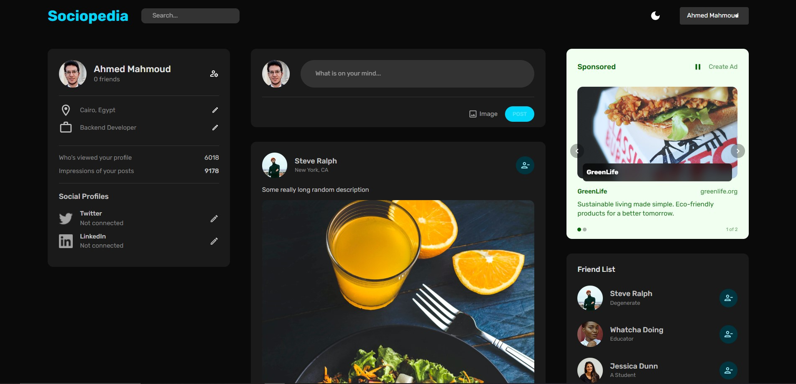

# Sociopedia - Full-Stack Social Media Platform



Welcome to **Sociopedia**, a comprehensive full-stack social media platform that combines modern web technologies to deliver a seamless, secure, and engaging user experience. This project showcases advanced features including dynamic content management, real-time interactions, and a sophisticated advertisement system.

## Key Features

### Advanced User Management
- **Secure Authentication & Authorization** with JWT tokens
- **Editable User Profiles** with social media integration
- **Dynamic Profile Updates** for location, occupation, and social links
- **Friend Connection System** with real-time updates

### Dynamic Content System
- **Post Creation & Management** with image upload support
- **Real-time Like & Comment System** with interactive UI
- **Feed Management** with chronological sorting
- **Image Processing** with error handling and fallbacks

### Advertisement Platform
- **Dynamic Advertisement Rotation** with smooth transitions
- **Click Tracking & Analytics** for advertisement performance

### Modern UI/UX
- **Material-UI Design System** with dark/light mode support
- **Responsive Design** optimized for all screen sizes
- **Smooth Animations** and transitions throughout the app
- **Interactive Components** with hover effects and feedback

## Application Screenshots

### Light Mode Interface

*Clean and modern interface in light mode*

### User Profile Management

*Comprehensive user profile with editable social links and friend management*

## Technologies Used

### Backend Architecture
- **Node.js & Express.js** - Scalable server architecture
- **MongoDB with Mongoose** - NoSQL database with ODM
- **JWT Authentication** - Secure token-based authentication
- **Bcrypt** - Password encryption and security
- **Multer** - File upload handling for images
- **Helmet & CORS** - Enhanced security middleware
- **Morgan** - HTTP request logging

### Frontend Technologies
- **React.js** - Modern component-based UI framework
- **Material-UI (MUI)** - Comprehensive design system
- **Redux Toolkit** - Predictable state management
- **Redux Persist** - State persistence across sessions
- **React Router** - Client-side routing
- **React Dropzone** - Drag-and-drop file uploads

### Database Models
- **User Model** - Profile management with social links
- **Post Model** - Content creation with engagement tracking
- **Advertisement Model** - Dynamic ad management with analytics
- **Comment System** - Nested commenting functionality

## Advanced Features

### Advertisement System
- **Real-time Ad Rotation** - Automatic content switching every 5 seconds
- **Click Analytics** - Comprehensive tracking and reporting
- **Dynamic Theming** - Ads adapt to content with custom colors
- **Priority Management** - Smart ad ordering based on performance
- **Budget & Cost Tracking** - Complete monetization system

### Social Features
- **Friend Management** - Add/remove friends with instant updates
- **Social Media Integration** - Connect Twitter, LinkedIn profiles
- **Profile Customization** - Edit personal information in real-time
- **Activity Tracking** - Profile views and post impressions

### User Experience
- **Theme Switching** - Seamless dark/light mode toggle
- **Responsive Design** - Optimized for desktop, tablet, and mobile
- **Loading States** - Smooth transitions and feedback
- **Error Handling** - Graceful fallbacks and user notifications


## Installation & Setup

### Prerequisites
- Node.js (v14 or higher)
- MongoDB (local or cloud instance)
- npm or yarn package manager

### Backend Setup
```bash
cd server
npm install
cp .env.example .env
npm start
```

### Frontend Setup
```bash
cd client
npm install
npm start
```

### Environment Variables
```env
MONGO_URL=your_mongodb_connection_string
JWT_SECRET=your_jwt_secret_key
PORT=3001
MAX_FILE_SIZE=10485760
```

## API Endpoints

### Authentication
- `POST /auth/register` - User registration with profile picture
- `POST /auth/login` - User authentication

### User Management
- `GET /users/:id` - Get user profile
- `PATCH /users/:id` - Update user information
- `GET /users/:id/friends` - Get user's friends list
- `PATCH /users/:id/:friendId` - Add/remove friends

### Posts & Content
- `GET /posts` - Get all posts (feed)
- `POST /posts` - Create new post with image
- `GET /posts/:userId` - Get user's posts
- `PATCH /posts/:id/like` - Like/unlike posts

### Advertisement System
- `GET /advertisements` - Get active advertisements
- `POST /advertisements/:id/click` - Record ad clicks
- `POST /advertisements` - Create new advertisement (admin)
- `PATCH /advertisements/:id` - Update advertisement (admin)

## Future Enhancements

### Planned Features
- **Real-time Messaging** - Direct messaging between users
- **Story Feature** - Temporary content sharing
- **Advanced Analytics** - Detailed user engagement metrics
- **Push Notifications** - Real-time alerts and updates
- **Content Moderation** - AI-powered content filtering
- **Mobile App** - React Native implementation
- **Video Support** - Video upload and streaming
- **Group Management** - Create and manage user groups

## License

This project is licensed under the MIT License - see the [LICENSE](LICENSE) file for details.
